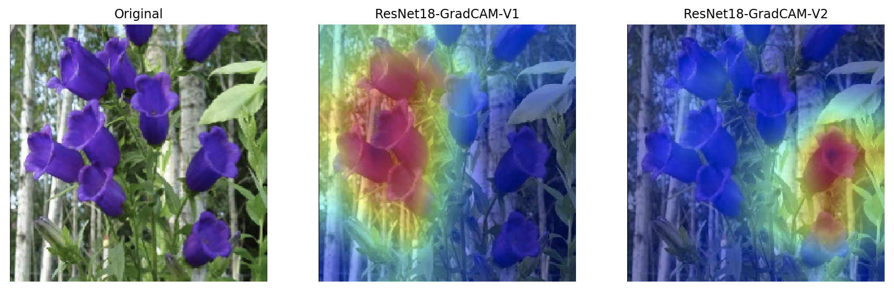

# Flowers-Classification

## Dataset: Oxford 102 Flowers

This dataset includes 8189 images of 102 (0 to 101) categories of flowers.

Of these, 

Number of images in training data = 1020  
Number of images in validation data = 1020  
Number of images in testing data = 6149  

## Task 

The task of this project is to use ResNet18 on Flowers Dataset for classification followed by GradCAM to get visual explanations of our model. Later, without making changes to epochs, improvise the model results.

## Navigation

[Flowers_ResNet18_V1.ipynb](Flowers_ResNet18_V1.ipynb):
  
  1. No Data Augmentation
  2. Simpler model:
```python
FFClassifier(
  (fc1): Linear(in_features=512, out_features=102, bias=True)
)
```

[Flowers_ResNet18_V2.ipynb](Flowers_ResNet18_V2.ipynb):
  
  1. Data Augmentation techniques like -
     -  Rotation by 45 degrees
     -  Crop from original images and obtain subplots
     -  Horizontal Flip  
  2. Deeper model (just 1 nn.Linear)
```python
FFClassifier(
  (fc1): Linear(in_features=512, out_features=4096, bias=True)
  (fc2): Linear(in_features=4096, out_features=102, bias=True)
)
```

This is done in order to improve our results. The training set has less number of images. Upon data augmentation, we generate more images to be used as training data. Also, deeper models might take longer to train every epoch but has the ability to learn better.

## Accuracy

Accuracy for V1 =  0.7660369251329295  
Accuracy for V2 =  0.8159778965354642

## Weakest Class

As observed in both [Flowers_ResNet18_V1.ipynb](Flowers_ResNet18_V1.ipynb) and [Flowers_ResNet18_V2.ipynb](Flowers_ResNet18_V2.ipynb), the weakest class is -

Class number = **2**
Flower name = Canterbury Bells

## GradCAM

Results obtained after applying GradCAM are stored in folders [cam_V1](cam_V1) and [cam_V2](cam_V2) respectively.

For an observation of class 2 which was predicted incorrectly for the simpler model ([Flowers_ResNet18_V1.ipynb](Flowers_ResNet18_V1.ipynb)) and correctly for the improved model ([Flowers_ResNet18_V2.ipynb](Flowers_ResNet18_V2.ipynb)), we can see the GradCAM results below:



## References

1. Problem Statement by [Fellowship.ai](https://www.fellowship.ai)
2. Dataset: https://www.robots.ox.ac.uk/~vgg/data/flowers/102/index.html
3. Data Augmentation: https://discuss.pytorch.org/t/data-augmentation-in-pytorch/7925
4. Transfer Learning: https://pytorch.org/tutorials/beginner/transfer_learning_tutorial.html
5. ResNet18: https://medium.com/@josh_2774/deep-learning-with-pytorch-9574e74d17ad
6. Labels: https://gist.github.com/JosephKJ/94c7728ed1a8e0cd87fe6a029769cde1#file-oxford-102_flower_dataset_labels-txt
7. GradCAM: https://github.com/Caoliangjie/pytorch-gradcam-resnet50/blob/master/grad-cam.py
